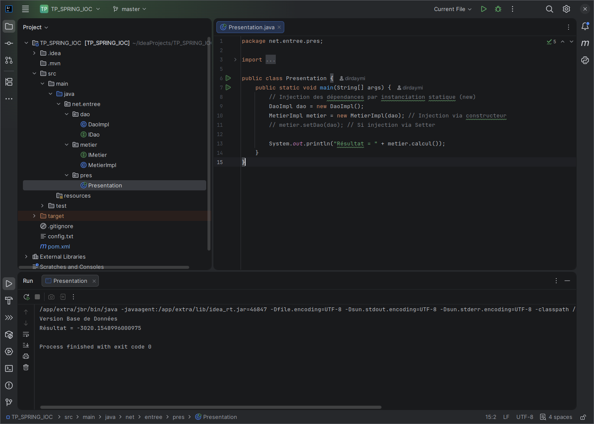
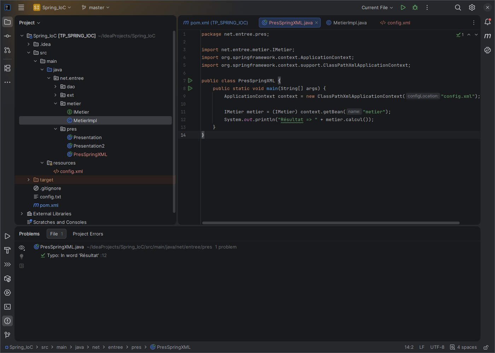
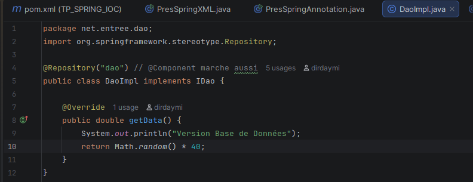
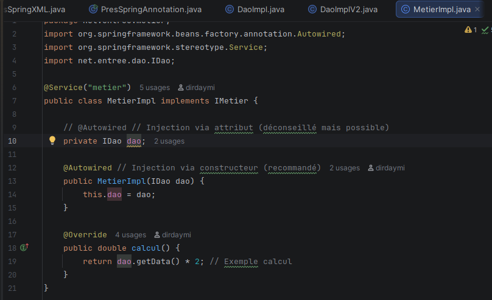

# Rapport de TP : Inversion de Contrôle & Injection de Dépendances

**Étudiant :** Abdel-hamid Mahamat LOUKI
**Module :** Architecture JEE / Spring
**Encadrant :** Pr. Mohamed Youssfi

##  Objectif
L'objectif de ce TP est de comprendre les mécanismes de l'Inversion de Contrôle (IoC) et de l'Injection de Dépendances (DI). Nous avons réalisé une application évolutive qui calcule des données, en passant par quatre étapes techniques :
1.  Couplage Fort (Statique)
2.  Couplage Faible (Dynamique)
3.  Framework Spring (Configuration XML)
4.  Framework Spring (Configuration Annotations)

---

##  Partie 1 : Instanciation Statique (Couplage Fort)
Dans cette première version, nous utilisons l'instanciation statique avec l'opérateur `new`. La classe `Presentation` crée directement les objets `DaoImpl` et `MetierImpl`.
Bien que nous utilisions des interfaces, le code reste ouvert à la modification car il faut changer le code source pour changer l'implémentation du DAO.

*Exécution de la version statique :*

---

##  Partie 2 : Instanciation Dynamique (Réflexion)
Pour rendre l'application fermée à la modification, nous avons utilisé la réflexion Java (`Class.forName()`) et un fichier de configuration externe.
Cela permet de changer l'implémentation du DAO ou du Métier sans toucher au code source.

*Exécution de la version dynamique :*

---

## Partie 3 : Framework Spring - Version XML
Nous avons délégué la responsabilité de l'instanciation et de l'injection des dépendances au conteneur Spring IoC.
La configuration est définie dans le fichier `config.xml`. Spring charge ce contexte et injecte les dépendances (via Setter ou Constructeur).

*Configuration XML (Bean DAO et Métier) :*

*Exécution de la version Spring XML :*

---

## Partie 4 : Framework Spring - Version Annotations
C'est la méthode la plus utilisée actuellement. Nous n'utilisons plus de XML, mais des annotations directement dans le code Java. Spring scanne les packages pour trouver les Beans.

### 1. Création des Beans
Nous avons utilisé l'annotation `@Repository` pour la couche DAO et `@Service` pour la couche Métier.

*Code DAO avec @Repository :*

### 2. Injection de dépendances
L'injection se fait via l'annotation `@Autowired`. Ici, nous avons utilisé l'injection par **constructeur** (recommandée).

*Code Métier avec @Service et @Autowired :*

### 3. Exécution
La classe `PresSpringAnnotation` charge le contexte via `AnnotationConfigApplicationContext` et scanne le package `net.entree`.

*Exécution finale avec Annotations :*

---

##  Conclusion
Ce TP a permis de démontrer l'évolution d'une application Java vers une architecture souple et maintenable. L'utilisation du Framework Spring, et particulièrement des annotations, simplifie considérablement la gestion des dépendances et le cycle de vie des objets.
